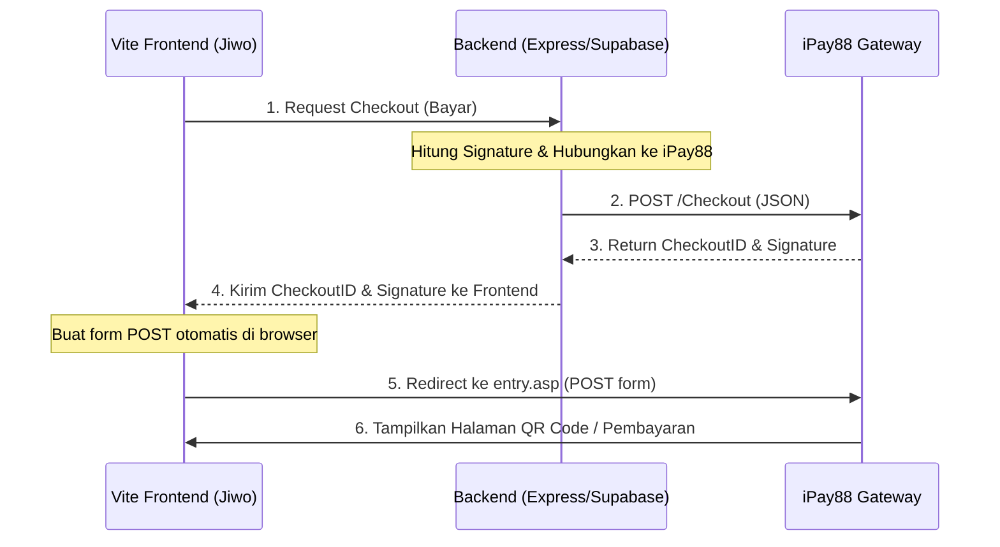

# Panduan Integrasi iPay88 QRIS ke Project Jiwo (Vite)

Karena project Jiwo menggunakan **Vite** (Client-side/SPA) dan bukan Next.js (Full-stack), terdapat perbedaan mendasar pada arsitektur integrasi payment gateway. 

> [!IMPORTANT]
> **PENTING: Jangan menghitung signature atau menaruh Merchant Key langsung di dalam kode Vite (Frontend).**
> `Merchant Key` adalah kredensial rahasia. Jika ditaruh di sisi client (Vite), siapapun bisa melihatnya melalui DevTools browser dan memalsukan transaksi. Seluruh proses pembuatan signature dan komunikasi API harus dilakukan di sisi **Backend** (misal: Express.js, NestJS, atau Supabase Edge Functions).

Berikut adalah pembagian arsitektur dan langkah-langkah pemindahan kode:

---

## 1. Pembagian Arsitektur Integrasi



---

## 2. Implementasi di Frontend (Vite)

Di sisi Vite, Anda hanya perlu membuat tombol pembayaran, memanggil API Backend Anda untuk mendapatkan payload checkout, dan mengarahkan user menggunakan form POST dinamis.

### A. Fungsi Trigger Pembayaran (React/Vue/JS)
Tambahkan fungsi ini pada komponen halaman checkout Jiwo Anda:

```typescript
import { useState } from "react";

export function CheckoutComponent() {
  const [loading, setLoading] = useState(false);
  const [error, setError] = useState<string | null>(null);

  const handlePayment = async () => {
    setLoading(true);
    setError(null);

    try {
      // 1. Panggil backend Anda sendiri untuk mendapatkan data checkout
      const response = await fetch("https://api-backend-jiwo.com/api/pay/ipay88", {
        method: "POST",
        headers: {
          "Content-Type": "application/json",
          // Tambahkan Authorization token jika diperlukan
        },
        body: JSON.stringify({
          amount: "10000", // Contoh nominal Rp10.000
          prodDesc: "Langganan Jiwo Premium",
        }),
      });

      const data = await response.json();

      if (!response.ok) {
        throw new Error(data.error || "Gagal membuat pembayaran");
      }

      // 2. Jika sukses, buat form POST secara dinamis di DOM dan submit otomatis
      if (data.checkout_url && data.payload) {
        const form = document.createElement("form");
        form.method = "POST";
        form.action = data.checkout_url;

        // Masukkan CheckoutID dan Signature yang didapat dari Backend
        Object.entries(data.payload).forEach(([key, value]) => {
          const input = document.createElement("input");
          input.type = "hidden";
          input.name = key;
          input.value = value as string;
          form.appendChild(input);
        });

        document.body.appendChild(form);
        form.submit();
      } else {
        throw new Error("Response tidak valid dari server");
      }
    } catch (err) {
      setError(err instanceof Error ? err.message : "Terjadi kesalahan");
      setLoading(false);
    }
  };

  return (
    <div>
      <button onClick={handlePayment} disabled={loading}>
        {loading ? "Memproses..." : "Bayar dengan QRIS"}
      </button>
      {error && <p style={{ color: "red" }}>{error}</p>}
    </div>
  );
}
```

### B. Halaman Result (`/result`)
Setelah pembayaran selesai (atau gagal), iPay88 akan me-redirect user kembali ke halaman Anda (melalui endpoint Response URL di backend, lalu backend mengarahkan ke halaman frontend).
Di routing Vite Anda (misal React Router), buat halaman `/result` yang menangkap query parameter status pembayaran:

```typescript
// Contoh di React Router (Vite)
import { useSearchParams, Link } from "react-router-dom";

export function PaymentResultPage() {
  const [searchParams] = useSearchParams();
  const status = searchParams.get("status"); // 'success' atau 'failed'
  const refNo = searchParams.get("refNo");
  const amount = searchParams.get("amount");
  const errDesc = searchParams.get("errDesc");

  return (
    <div className="result-container">
      {status === "success" ? (
        <h1>✅ Pembayaran Berhasil!</h1>
      ) : (
        <h1>❌ Pembayaran Gagal</h1>
      )}
      <p>Nomor Referensi: {refNo}</p>
      {errDesc && <p>Keterangan: {errDesc}</p>}
      <Link to="/dashboard">Kembali ke Beranda</Link>
    </div>
  );
}
```

---

## 3. Implementasi di Backend (Express.js / Node.js)

Karena Jiwo tidak memiliki backend bawaan seperti Next.js, Anda perlu memindahkan API route ke backend server Jiwo. Berikut contoh menggunakan **Express.js**:

### A. Tambahkan Dependensi di Backend
Pastikan backend Anda memiliki library `crypto` (bawaan Node.js) untuk enkripsi signature.

### B. Endpoint Pembuatan Checkout (`POST /api/pay/ipay88`)
Buat route baru di file express router Anda (misal `paymentRoutes.js`):

```javascript
const express = require("express");
const crypto = require("crypto");
const router = express.Router();

// 1. Fungsi pembuatan SHA256 Signature
function generateSignature(merchantKey, merchantCode, refNo, amount, currency) {
    const signatureString = `||${merchantKey}||${merchantCode}||${refNo}||${amount}||${currency}||`;
    return crypto.createHash("sha256").update(signatureString).digest("hex");
}

// 2. Endpoint Pembuatan Payment
router.post("/api/pay/ipay88", async (req, res) => {
    try {
        const merchantCode = process.env.IPAY88_MERCHANT_CODE;
        const merchantKey = process.env.IPAY88_MERCHANT_KEY;
        const isProd = process.env.NODE_ENV === "production";
        
        // Pilih URL Endpoint berdasarkan environment
        const apiUrl = isProd 
            ? "https://payment.ipay88.co.id/ePayment/WebService/PaymentAPI/Checkout"
            : "https://sandbox.ipay88.co.id/ePayment/WebService/PaymentAPI/Checkout";
            
        const checkoutUrl = isProd
            ? "https://payment.ipay88.co.id/ePayment/entry.asp"
            : "https://sandbox.ipay88.co.id/ePayment/entry.asp";

        const paymentId = isProd ? "120" : "78"; // 120 = QRIS Prod, 78 = Nobu QRIS Sandbox
        const currency = "IDR";
        const amount = "10000"; // Dari request body jika dinamis
        const refNo = `QR${Date.now()}`; // Pastikan unik
        const baseUrl = process.env.FRONTEND_URL || "http://localhost:5173"; // URL Vite Anda

        // Generate signature untuk request ke iPay88
        const signature = generateSignature(
            merchantKey,
            merchantCode,
            refNo,
            amount,
            currency
        );

        // Siapkan request payload
        const payload = {
            APIVersion: "2.0",
            MerchantCode: merchantCode,
            PaymentId: paymentId,
            Currency: currency,
            RefNo: refNo,
            Amount: amount,
            ProdDesc: req.body.prodDesc || "Product Payment",
            UserName: req.body.userName || "Customer Jiwo",
            UserEmail: req.body.userEmail || "customer@jiwo.ai",
            UserContact: req.body.userContact || "081234567890",
            Remark: "",
            Lang: "UTF-8",
            RequestType: "REDIRECT",
            ResponseURL: `${process.env.BACKEND_URL}/api/webhooks/ipay88/response`,
            BackendURL: `${process.env.BACKEND_URL}/api/webhooks/ipay88/backend`,
            Signature: signature,
        };

        // Call iPay88 Web Service
        const response = await fetch(apiUrl, {
            method: "POST",
            headers: { "Content-Type": "application/json" },
            body: JSON.stringify(payload),
        });

        const data = await response.json();

        if (data.Code === "1" && data.CheckoutID) {
            // Kirim CheckoutID dan Signature iPay88 ke Frontend Vite
            return res.json({
                success: true,
                checkout_url: checkoutUrl,
                payload: {
                    CheckoutID: data.CheckoutID,
                    Signature: data.Signature,
                },
            });
        } else {
            return res.status(400).json({ error: data.Message || "Gagal memproses pembayaran ke iPay88" });
        }
    } catch (error) {
        console.error("Payment error:", error);
        return res.status(500).json({ error: "Internal server error" });
    }
});

module.exports = router;
```

### C. Endpoint Response URL (`POST /api/webhooks/ipay88/response`)
iPay88 akan mem-POST data status ke endpoint ini di backend Anda. Dari sini, Anda me-redirect user kembali ke frontend Vite:

```javascript
router.post("/api/webhooks/ipay88/response", express.urlencoded({ extended: true }), (req, res) => {
    try {
        const { Status, RefNo, Amount, ErrDesc, TransId } = req.body;
        const isSuccess = Status === "1";
        
        const frontendUrl = process.env.FRONTEND_URL || "http://localhost:5173";
        
        // Redirect balik user ke halaman /result di Vite
        const redirectUrl = `${frontendUrl}/result?status=${isSuccess ? 'success' : 'failed'}&refNo=${RefNo}&amount=${Amount}&errDesc=${ErrDesc || ''}&transId=${TransId || ''}`;
        
        return res.redirect(redirectUrl);
    } catch (error) {
        console.error(error);
        res.redirect(`${process.env.FRONTEND_URL}/result?status=error`);
    }
});
```

---

## 4. Opsi Alternatif: Supabase Edge Functions (Deno)

Jika Jiwo menggunakan **Supabase** secara penuh tanpa server backend terpisah, Anda dapat membuat **Supabase Edge Function** untuk menangani pembuatan signature dan webhook iPay88 ini.

*   Proses enkripsi signature di Deno menggunakan module `crypto`:
    ```typescript
    import { crypto } from "https://deno.land/std@0.177.0/crypto/mod.ts";
    // Enkripsi signature SHA-256 di Deno
    ```

---

## Ringkasan File yang Harus Disiapkan di Jiwo
1.  **Frontend (Vite):** 
    *   Halaman Pembayaran (Komponen tombol dan script pemicu redirect ke iPay88).
    *   Halaman `/result` (Penerima redirect untuk menampilkan sukses/gagal).
2.  **Backend (Express/Supabase):**
    *   Fungsi Hash Signature (`sha256` atau `hmac-sha512` sesuai instruksi terbaru).
    *   API Endpoint `/checkout` (Menghubungkan payload awal ke iPay88).
    *   API Endpoint `/response` (Menerima input POST redirect iPay88 dan mengarahkannya kembali ke Vite).
    *   API Endpoint `/backend` (Menerima status transaksi final untuk update database Jiwo secara async).
